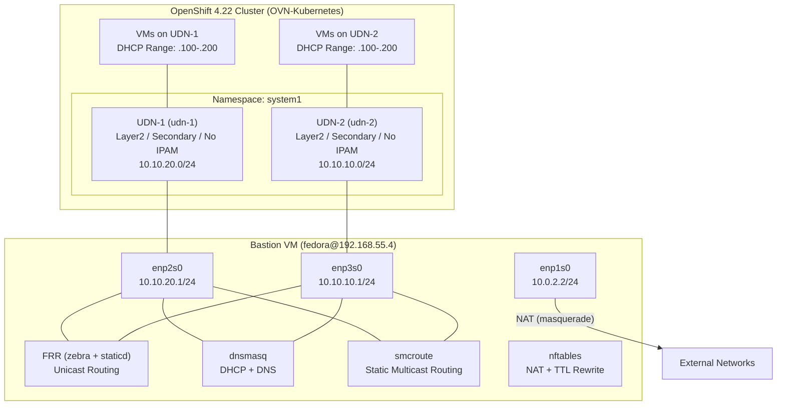
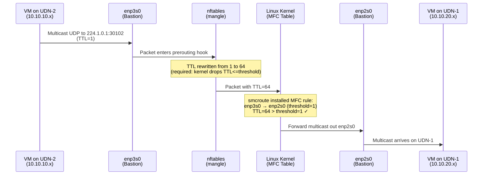
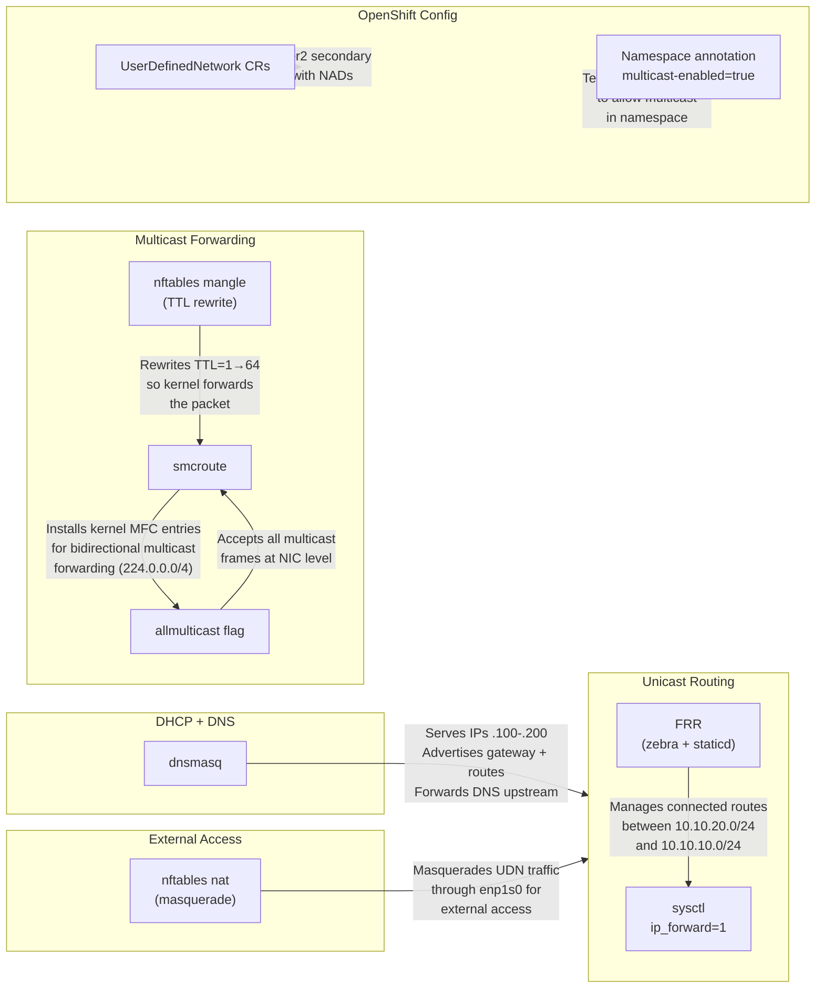
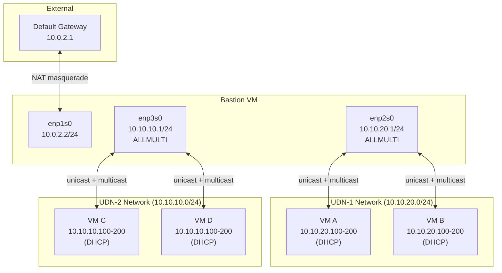

# UDN Multicast Routing Solution

This document describes the end-to-end setup for enabling multicast routing between two OpenShift User Defined Networks (UDNs) using a Fedora bastion VM running FRR, dnsmasq, smcroute, and nftables.

## Architecture Overview



## Multicast Packet Flow



## Component Responsibilities



## Software Components

| Component | Package | Version | Purpose |
|-----------|---------|---------|---------|
| FRR | `frr` | 10.7.0 | Unicast routing daemon (zebra manages kernel routes, staticd for static routes) |
| dnsmasq | `dnsmasq` | 2.92 | Lightweight DHCP server and DNS forwarder for both UDN networks |
| smcroute | `smcroute` | 2.5.7 | Static multicast routing daemon - installs kernel MFC entries without requiring PIM/IGMP |
| nftables | (built-in) | - | NAT masquerade for external access + TTL mangle for multicast forwarding |
| OVN-Kubernetes | (cluster) | 4.22.9 | OpenShift CNI providing UDN support and namespace-level multicast enablement |

## Configuration Details

### OpenShift Resources

#### Namespace with Multicast

```yaml
apiVersion: v1
kind: Namespace
metadata:
  name: system1
  annotations:
    k8s.ovn.org/multicast-enabled: "true"
```

OVN-Kubernetes does not have a cluster-wide multicast toggle. Multicast must be enabled per-namespace via this annotation. This tells OVN to allow multicast traffic within the namespace rather than dropping it.

#### User Defined Networks

Two namespace-scoped UDNs provide Layer2 networks for virtual machines:

```yaml
apiVersion: k8s.ovn.org/v1
kind: UserDefinedNetwork
metadata:
  name: udn-1
  namespace: system1
spec:
  topology: Layer2
  layer2:
    role: Secondary
    ipam:
      mode: Disabled
---
apiVersion: k8s.ovn.org/v1
kind: UserDefinedNetwork
metadata:
  name: udn-2
  namespace: system1
spec:
  topology: Layer2
  layer2:
    role: Secondary
    ipam:
      mode: Disabled
```

- **Layer2 topology**: Flat L2 network, no overlay routing
- **Secondary role**: Additional network alongside the default cluster network
- **IPAM Disabled**: The bastion's dnsmasq handles IP assignment, not OVN

OVN-Kubernetes automatically creates `NetworkAttachmentDefinition` resources for each UDN, which VMs reference in their network interface specs.

### Bastion VM Configuration

#### IP Forwarding

```bash
# /etc/sysctl.d/99-ip-forward.conf
net.ipv4.ip_forward = 1
```

Required for the kernel to route packets between interfaces. Without this, packets arriving on one interface destined for another subnet are silently dropped.

#### FRR (`/etc/frr/frr.conf`)

```
frr version 10.7
frr defaults traditional
hostname router
log syslog informational
service integrated-vtysh-config

interface enp2s0
 description UDN-1 network (10.10.20.0/24)

interface enp3s0
 description UDN-2 network (10.10.10.0/24)
```

FRR's `zebra` daemon manages the kernel routing table. Since both subnets are directly connected, no static routes are needed - zebra picks up the connected routes automatically:

- `10.10.20.0/24` via `enp2s0`
- `10.10.10.0/24` via `enp3s0`

PIM was initially enabled for multicast but was replaced with smcroute because PIM requires IGMP joins from receivers before forwarding traffic. smcroute provides unconditional static forwarding.

#### dnsmasq (`/etc/dnsmasq.d/udn-dhcp.conf`)

```
# Listen only on UDN interfaces
interface=enp2s0
interface=enp3s0
bind-interfaces

# UDN-1: 10.10.20.0/24 on enp2s0
dhcp-range=enp2s0,10.10.20.100,10.10.20.200,255.255.255.0,12h
dhcp-option=enp2s0,option:router,10.10.20.1
dhcp-option=enp2s0,option:dns-server,10.10.20.1

# UDN-2: 10.10.10.0/24 on enp3s0
dhcp-range=enp3s0,10.10.10.100,10.10.10.200,255.255.255.0,12h
dhcp-option=enp3s0,option:router,10.10.10.1
dhcp-option=enp3s0,option:dns-server,10.10.10.1

# Add static route so each network knows about the other
dhcp-option=enp2s0,option:classless-static-route,10.10.10.0/24,10.10.20.1
dhcp-option=enp3s0,option:classless-static-route,10.10.20.0/24,10.10.10.1
```

- **Per-interface scopes**: Each interface gets its own DHCP pool and options
- **Gateway advertisement**: VMs learn the bastion as their default gateway
- **Classless static routes**: DHCP option 121 pushes routes so VMs on one network know how to reach the other via the bastion
- **DNS forwarding**: dnsmasq forwards DNS queries upstream using the bastion's `/etc/resolv.conf`
- **Address range**: `.100-.200` per subnet (101 addresses), leaving `.1-.99` for static assignments and `.201-.254` for infrastructure

#### smcroute (`/etc/smcroute.conf`)

```
# Set TTL threshold to 0 so TTL=1 packets get forwarded
phyint enp2s0 ttl-threshold 0
phyint enp3s0 ttl-threshold 0

# Forward all multicast between UDN-1 and UDN-2
mroute from enp2s0 group 224.0.0.0/4 to enp3s0
mroute from enp3s0 group 224.0.0.0/4 to enp2s0
```

smcroute was chosen over FRR's PIM for a specific reason:

- **PIM-SM (Sparse Mode)** requires receivers to send IGMP joins before the router will forward multicast. This adds complexity and means receivers must explicitly subscribe to groups.
- **smcroute** installs static kernel Multicast Forwarding Cache (MFC) entries that forward unconditionally. Any multicast packet arriving on one interface is immediately forwarded to the other - no protocol negotiation required.

The `mroute` rules use `224.0.0.0/4` to match the entire multicast address range (224.0.0.0 - 239.255.255.255).

#### Allmulticast Mode

```bash
ip link set enp2s0 allmulticast on
ip link set enp3s0 allmulticast on
```

Persisted via NetworkManager dispatcher (`/etc/NetworkManager/dispatcher.d/99-allmulti`).

By default, a network interface only accepts multicast frames for groups it has explicitly joined. The `ALLMULTI` flag tells the NIC to accept all multicast frames, which is necessary since smcroute forwards all groups and we don't know which ones will be used in advance.

#### nftables (NAT + TTL Mangle)

```
table ip nat {
    chain postrouting {
        type nat hook postrouting priority srcnat; policy accept;
        oifname "enp1s0" masquerade
    }
}

table ip mangle {
    chain prerouting {
        type filter hook prerouting priority mangle; policy accept;
        ip daddr 224.0.0.0/4 ip ttl set 64
    }
}
```

Persisted to `/etc/nftables/nat.nft` and loaded by the `nftables` systemd service on boot.

**NAT table**: Masquerades outbound traffic from both UDN networks through `enp1s0` so VMs can reach external networks. Source IPs are rewritten to the bastion's external address (10.0.2.2).

**Mangle table (TTL rewrite)**: This is the critical fix for multicast forwarding. The Linux kernel's multicast routing checks:

```
if (packet TTL <= VIF TTL threshold) → drop, do not forward
```

The problem:
1. Multicast senders (e.g., `socat`) default to **TTL=1**
2. smcroute creates VIF entries with **TTL threshold=1**
3. The kernel evaluates `1 <= 1` → **true** → packet is **dropped**

The `phyint ttl-threshold 0` directive in smcroute.conf did not take effect in this version (2.5.7), so the threshold remained at 1. The nftables mangle rule works around this by rewriting the TTL to 64 in the prerouting hook, which runs before the kernel's multicast forwarding decision:

```
TTL=64 <= threshold=1 → false → packet is forwarded ✓
```

## Network Topology



## Service Status Summary

| Service | Enabled | Config File |
|---------|---------|-------------|
| `frr` | Yes | `/etc/frr/frr.conf`, `/etc/frr/daemons` |
| `dnsmasq` | Yes | `/etc/dnsmasq.d/udn-dhcp.conf` |
| `smcroute` | Yes | `/etc/smcroute.conf` |
| `nftables` | Yes | `/etc/nftables/nat.nft` |

## Testing Multicast

To verify multicast is forwarding between the two UDN networks:

**On a VM on UDN-1 (10.10.20.0/24)** - start a receiver:
```bash
socat UDP4-RECVFROM:30102,ip-add-membership=224.1.0.1:0.0.0.0,fork -
```

**On a VM on UDN-2 (10.10.10.0/24)** - send a message:
```bash
echo "hello multicast" | socat - UDP4-DATAGRAM:224.1.0.1:30102
```

The receiver should print `hello multicast`.

**On the bastion** - observe forwarding:
```bash
sudo tcpdump -i any -n 'host 224.1.0.1'
```

You should see packets arriving on `enp3s0` and being forwarded out `enp2s0` (or vice versa).

## Troubleshooting

### Multicast not forwarding

1. Check smcroute is running and has MFC entries:
   ```bash
   sudo smcroutectl show
   cat /proc/net/ip_mr_cache
   ```

2. Verify the TTL mangle rule is active:
   ```bash
   sudo nft list table ip mangle
   ```

3. Check `mc_forwarding` is enabled (set automatically by smcroute):
   ```bash
   cat /proc/sys/net/ipv4/conf/all/mc_forwarding
   ```

4. Verify `ALLMULTI` is set on both interfaces:
   ```bash
   ip link show enp2s0 | grep ALLMULTI
   ip link show enp3s0 | grep ALLMULTI
   ```

### DHCP not working

1. Check dnsmasq is listening:
   ```bash
   sudo ss -ulnp | grep dnsmasq
   ```

2. View active leases:
   ```bash
   cat /var/lib/dnsmasq/dnsmasq.leases
   ```

### Unicast routing not working

1. Verify IP forwarding:
   ```bash
   sysctl net.ipv4.ip_forward
   ```

2. Check FRR routing table:
   ```bash
   sudo vtysh -c 'show ip route'
   ```
